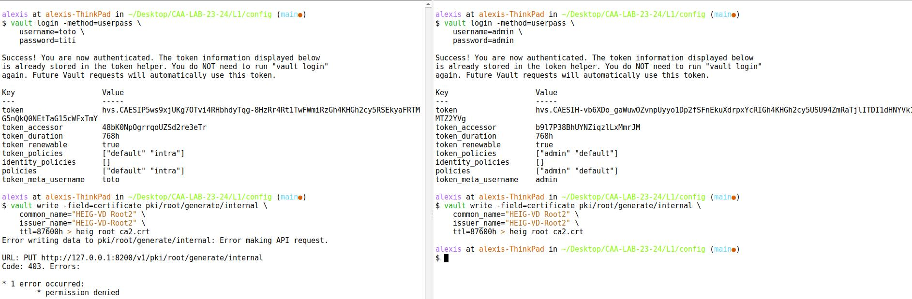

---
title: "Lab report #1"
author: [Alexis Martins]
date: \today
subject: "HashiCorp Vault"
subtitle: "CAA 2023 - HashiCorp Vault"
lang: "en"
titlepage: true
titlepage-logo: ./figures/HEIG-Logo.png
titlepage-rule-color: "D9291B"
toc: true
toc-own-page: true
number-sections: true
caption-justification: centering
graphics: yes
geometry: "top=2cm, bottom=2cm, left=2cm, right=2cm"
header-includes:
    - \usepackage{amssymb}
...

# Starting the Vault server

## What is the goal of the unseal process. Why are they more than one unsealing key?

From the [documentation](https://developer.hashicorp.com/vault/docs/concepts/seal):
Unsealing is the process of obtaining the plaintext root key necessary to decrypt the encryption key to decrypt the data, allowing access to the Vault.

The purpose of the unseal keys is to improve the security. The security doesn't rely on one single key or one single person. If one key gets stolen, the thief won't have access to the vault items. This adds a layer of security because it mitigates the risk of a single person or entity gaining unauthorized access.

This technique is known as the Shamir's secret sharing. It allows to share a secret with multiple people without fully telling them the secret directly. We divide the secret into shares and every person has a share. When a certain number of shares are combined, we have "reassembled" the secret.


## What is a security officer. What do you do if one leaves the company?

In IT, it refers to an individual or a role within an organization responsible for overseeing, managing and monitoring security-related aspects of the system.

If a SO leaves the company (and he knew about one of the unseal keys), we should generate new shares with the `rekey` method*. We also should rotate the encryption key. Finally, we have to revoke all his access and credentials (in the company and in Vault).

*_Note :_ The documentation specifies it doesn't cause any downtime, but it requires to combine the needed amount of unseal keys and unseal the vault.

# PKI

## Why is it recommended to store the root certificate private key outside of Vault (we did not do this here)?

If the root certificate private key is in the vault, it's also on the network. It could be attacked by anyone. If the private key is compromised, all the certificate below can't be trusted anymore. If the root certificate private key is offline, it can't be attacked anymore through the network. We create intermediate CA which are online to sign the certificates below.


## Where would you typically store the root certificate private key?

On a Hardware Security Module (HSM). As I said previously, these keys are also stored offline to prevent any network attack.

I found this complete [answer](https://security.stackexchange.com/questions/24896/how-do-certification-authorities-store-their-private-root-keys) on StackExchange. It highlights the main aspects.

## What do you need to do in Vault to store the root certificate private key outside of Vault?

We have to create one or more interemdiate CAs, these will be the ones signing the end certificates (or another level intermediate CA like the schema below). This way, we can store the root CA private key offline after having signed the intermediate CA certificate with it. The intermediate CAs certificates will be the ones in the Vault/on the network. The schema from HashiCorp below illustrates perfectly the situation.


## How is the intermediate certificate private key secured

The intermediate certificate private key is in the vault. All the items in the vault are encrypted until the vault is unsealed by re-uniting the necessary amount of unseal keys.

## In the certificate for intra.heig-vd.ch, what is its duration of validity? What is the name of its issuer

```
Issuer: CN = HEIG-VD Intermediate
Validity
   Not Before: Sep 25 21:22:39 2023 GMT
   Not After : Sep 26 21:23:08 2023 
```
A validity of of 24 hours, 0 minutes, 30 seconds.

## What do you need to do concretely for the intra.heig-vd.ch certificate to be accepted by browsers

We have to install the root certificate in the web browser. Plus we have to configure the webserver like we did in last CRY lab by installing the certificate chain on it.

## What is a wildcard certificate? What are its advantages and disadvantages

It's a certificate with a wildcard character (\*) and it allows to to secure multiple subdomains for a given domain (only the first level subdomains).
For example, the certificate \*.heig-vd.ch will cover the domain www.heig-vd.ch, mail.heig-vd.ch and all the subdomains with one level.

It's easier to set up because we don't have to set up a certificate for every subdomain. It's also cheaper, we don't need to buy multiple certificates.

Even if it protects multiple subdomains, it only applies to primary level subdomains (like the ones given above). The problem is that when one subdomain is compromised (private key compromised), every subdomain related to this certificate is also compromised. Having multiple domains under the same certificate increases the attack surface.

# Users

## Comparison admin and intra



# Final Questions

## How is the root key and the encryption key used to secure Vault

Root key is shared in a series of keys (unseal keys) when we re-unify them, it creates the root key.
This root key is used to decrypt the underlying encryption key. Then Vault will use this encryption key to encrypt the data when Vault is at rest and decrypt the data when we need it.

## What is key rotation and when is it done

Key rotation is the operation to change the encryption key periodically to response a potential leak, breach or compromise.

It could happen automatically, by default these are the parameters :

```
# vault read sys/rotate/config

Key               Value
---               -----
enabled           true
interval          0
max_operations    3865470566
``` 

We can set up a temporal limit or a maximum of operations done with this key.
It's also possible to force the rotation manually with the `vault operator rotate`, it could be useful if we discover a security breach or any problem with data security.

On the [HashiCorp website](https://developer.hashicorp.com/vault/docs/internals/rotation), there is also a guidance given by the NIST. They tell us that keys should be rotated before approximately $2^{32}$ encryptions have been performed (Vault has followed this guidance since Vault 1.7). See also NIST publication 800-38D.

## What can you say about the confidentiality of data in the storage backend? How is it done

According to there [security model](https://developer.hashicorp.com/vault/docs/internals/security) description, the backend storage is considered unsafe by design.
This means they are encrypting all the data before it reaches the backend that could potentially be compromised.
Encryption is done with AES-256-GCM and a 96 bits nonce.

## What can you say about the security of Vault against an adversary that analyses the memory of the server that runs Vault?

According to the security model above, we can read the following lines :

>The following are not considered part of the Vault threat model:
>
>Protecting against memory analysis of a running Vault. If an attacker is able to inspect the memory state of a running Vault instance, then the confidentiality of data may be compromised.
